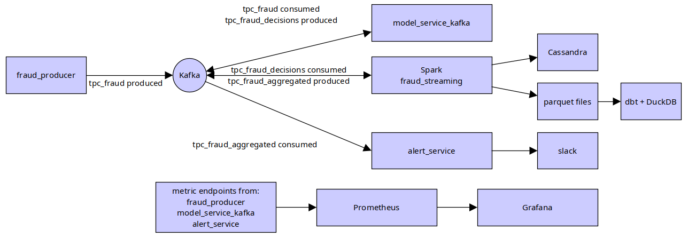
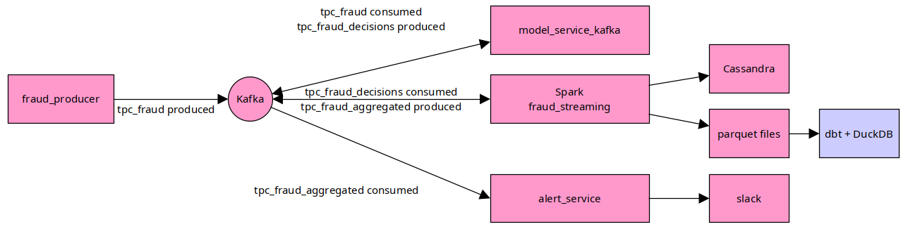
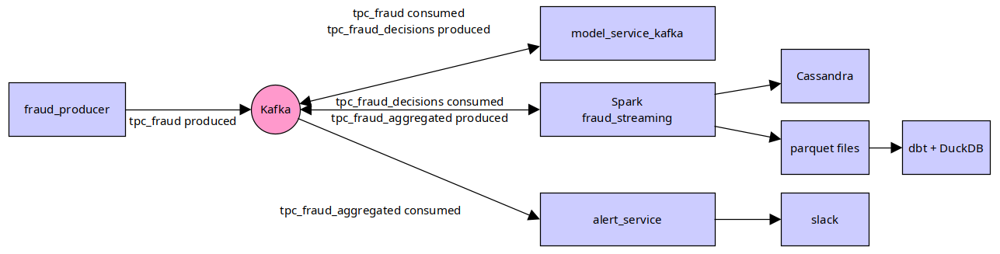
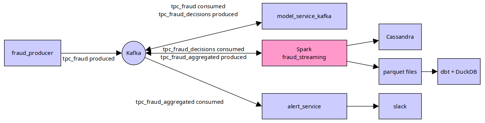
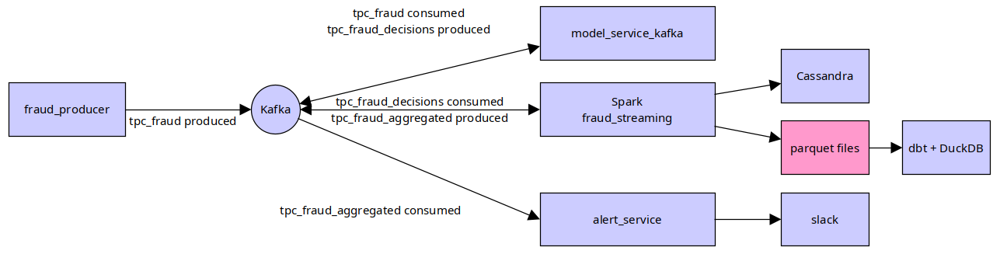
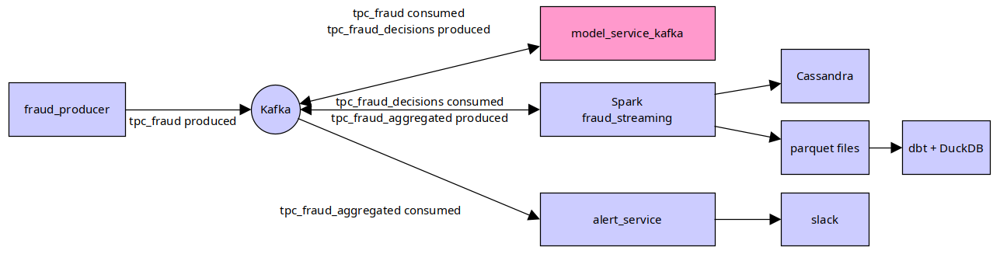
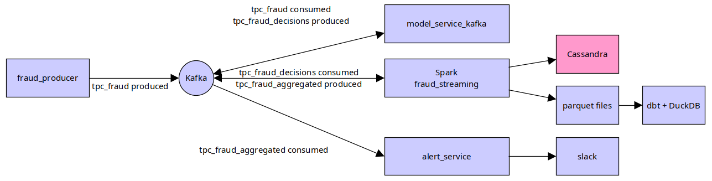
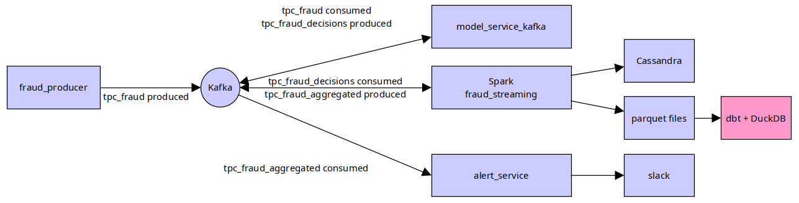
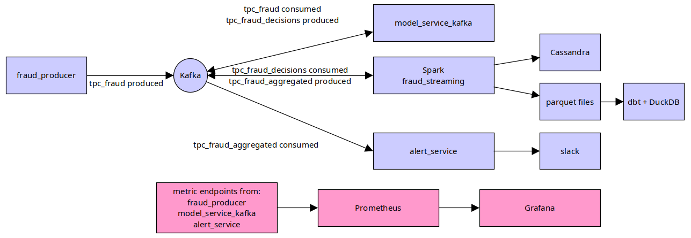
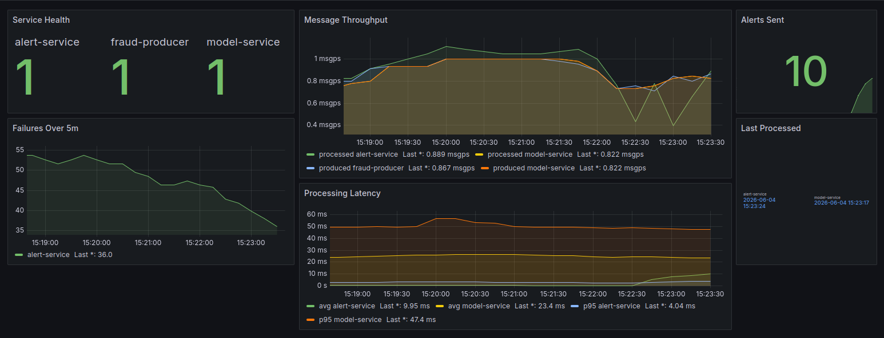

# Fraud Pipeline

Real-time fraud detection pipeline and local analytics on the streaming parquet lake. 

Stack: Kafka, Spark Structured Streaming, scikit-learn, Cassandra, Parquet, DuckDB, dbt, Prometheus, Grafana

## Context

- Use case: monitoring potentially fraudulent transactions
- Business need: quickly detect risky transactions
- Two levels of response are expected:
  - transaction-level decision: ALLOW or BLOCK
  - aggregated alert: fraud spike over a micro-window
- Key concerns: low latency, traceability, historical analysis, supervision

## Architecture



- Step 1: generate a JSON transaction
- Step 2: publish it to tpc_fraud
- Step 3: score it with ML and publish to tpc_fraud_decisions
- Step 4: process it with Spark every 5 seconds
- Step 5: store BLOCK decisions in Cassandra
- Step 6: store all decisions in Parquet
- Step 7: publish alerts to tpc_alerts_aggregated
- Step 8: Slack, dbt, Grafana

## Technical choices: batch versus streaming



This project uses streaming because fraud detection is time-sensitive. A batch pipeline would be useful for historical reporting, model evaluation, or daily aggregates, but it would
detect risky transactions too late for operational blocking. In this image everything except dbt+DuckDB is streaming.

Streaming allows each transaction to be evaluated as soon as it is produced, then routed to downstream systems with low latency:

- Kafka decouples producers and consumers.
- The ML service scores transactions continuously.
- Spark Structured Streaming aggregates decisions over short windows.
- Cassandra stores blocked transactions for fast lookup.
- Parquet keeps the full decision history for analytics and dbt.

Batch processing is still useful in this architecture for offline analysis, dashboarding, and model improvement. The pipeline therefore combines both patterns: streaming for real-
time decisions, batch-style analytics on Parquet for historical insight.

## Technical choices: Kafka



Kafka is used as the central event backbone of the pipeline. It decouples transaction production, fraud scoring, streaming aggregation, and alerting so each service can evolve and
restart independently.

The pipeline uses separate topics for each stage:

- `tpc_fraud` receives raw transaction events.
- `tpc_fraud_decisions` receives scored decisions from the ML service.
- `tpc_alerts_aggregated` receives aggregated fraud alerts from Spark.

This topic separation keeps responsibilities clear and makes the data flow easier to observe and debug. Kafka also provides buffering: if one consumer is temporarily unavailable,
events can remain available in the topic and be processed when the service comes back.

Kafka is therefore a good fit for this project because fraud detection needs low-latency event delivery, replayability for debugging, and loose coupling between producer, model
service, Spark processing, and alerting.

## Technical choices: Spark



Spark Structured Streaming is used to process scored fraud decisions continuously. It reads events from Kafka, applies streaming transformations, and writes the results to
operational and analytical storage.

In this pipeline, Spark has three main roles:

- Consume scored decisions from `tpc_fraud_decisions`.
- Persist blocked transactions to Cassandra for operational lookup.
- Write all fraud decisions to Parquet for historical analysis with DuckDB and dbt.

Spark is useful here because it provides a unified model for streaming and batch-style processing. The same concepts used for analytical transformations, such as schemas,
aggregations, and windowing, can be applied to live event streams.

The pipeline uses micro-batches to balance latency and reliability. This makes the system responsive enough for fraud monitoring while keeping processing deterministic, traceable,
and easier to debug locally.


## Technical choices: Parquet versus Avro



Parquet and Avro are both common formats in data pipelines, but they serve different purposes.

Avro is row-oriented and well suited for event transport, schema evolution, and message serialization. It is a good fit when records are exchanged between services, especially with
Kafka and a schema registry.

Parquet is column-oriented and optimized for analytical workloads. It is more efficient when queries read only a subset of columns, aggregate large datasets, or scan historical data.

In this project, Parquet is used for the decision history because the data is later queried by DuckDB, dbt, and analytical tools. Typical questions focus on trends, counts, ratios,
and time windows, which benefit from Parquet's columnar layout and compression.

Avro would be a strong option for formalizing Kafka message contracts in a production version of the pipeline. For the local project, JSON keeps Kafka messages easy to inspect, while
Parquet provides an efficient format for analytics.

## ML scoring service



- File: model_service_kafka.py
- Loads models/fraud_model.pkl with joblib
- Features used:
    - amount 
    - country_risk
- Model: RandomForestClassifier
- Threshold: fraud_threshold_model = 0.8
- Output: BLOCK if probability > 0.8, otherwise ALLOW

## Technical choices: Cassandra



Cassandra is used to store blocked transactions produced by the streaming pipeline. These records are operational data: they represent transactions that may require fast lookup,
investigation, or downstream action.

>**Note**
> - Operational data: used now, by the application or operators, for action.
> - Analytical data: used later, for reporting, exploration, metrics, and trends.

Cassandra fits this use case because it is designed for high write throughput and low-latency reads at scale. In a fraud detection context, the system may need to ingest many
decisions continuously while keeping recent blocked transactions quickly accessible.

In this project, Spark writes `BLOCK` decisions to Cassandra while all decisions are also stored in Parquet for analytics. This separates operational storage from analytical storage:

- Cassandra keeps the actionable subset of decisions.
- Parquet keeps the complete historical dataset.
- dbt and DuckDB query Parquet instead of putting analytical load on Cassandra.

This design keeps Cassandra focused on serving operational fraud data, while historical analysis is handled by formats and tools better suited for scans and aggregations.

## Technical choices: Dbt



dbt is used to structure the analytical layer of the project. It reads the Parquet files written by the streaming pipeline and transforms them into reusable SQL models.

In this project, dbt is not part of the real-time decision path. It runs after data has already been produced by Kafka, processed by Spark, and stored in Parquet. Its role is to make
the historical decision data easier to query, document, and extend.

The dbt layer is useful because it brings software engineering practices to analytics:

- SQL transformations are versioned in the repository.
- Models are organized into staging and marts.
- Business definitions can be centralized and reused.
- Tests and documentation can be added as the analytics layer grows.

DuckDB is used as the local analytical engine behind dbt. This keeps the setup lightweight while still allowing efficient queries over Parquet files.

In short, dbt turns the raw streaming output into a cleaner analytical layer for reporting, exploration, and future dashboarding.

## Technical choices: Prometheus and Grafana



Prometheus and Grafana are used to observe the behavior of the fraud detection pipeline while it is running.

Prometheus collects metrics exposed by the Python services, such as the number of produced messages, processed decisions, failed messages, and processing latency. These metrics make
it possible to detect operational issues such as stopped consumers, increasing error rates, or abnormal processing delays.

Grafana provides dashboards on top of Prometheus. It makes the pipeline easier to monitor visually by showing counters, rates, and latency trends in one place.

In this project, observability is useful for both technical and business monitoring:

- Technical monitoring checks whether the services are running correctly.
- Business monitoring checks whether fraud-related activity changes unexpectedly.
- Latency metrics help verify that the pipeline remains close to real time.
- Failure metrics help identify broken integrations or malformed messages.

This makes Prometheus and Grafana a good fit for supervising a streaming fraud pipeline, where both reliability and timely detection matter.

## Project

```
fraud_pipeline/
├── docker-compose.yml       # Full stack (infra + streaming apps)
├── README.md                # Main project documentation
├── docs/images/archi.png    # Architecture and technical choice diagrams
├── fraud_streaming/         # Kafka, Spark, model, alerts, parquet lake
│   ├── src/app/             # Producer, model service, Spark job, alerts, observability
│   ├── src/lib/             # Shared helpers
│   ├── models/              # Trained fraud model artifact
│   ├── scripts/             # Kafka topic creation script
│   ├── tests/               # Unit tests
│   ├── docker-compose-kafka-cassandra.yml
│   ├── docker-compose-spark.yml
│   └── docker-compose.yml   # App services only (modular)
├── dbt/                     # DuckDB + dbt on local parquet
│   ├── models/staging/      # Staging models over parquet data
│   ├── models/marts/        # Analytics marts
│   ├── dbt_project.yml
│   ├── profiles.yml
│   └── docker-compose.yml
├── monitoring/              # Prometheus and Grafana provisioning
│   ├── prometheus/
│   └── grafana/
├── docs/                    # Presentation and generated documentation images
└── scripts/                 # Utility scripts, including presentation generation
```

## Starting everything

### 1. Train the fraud model to produce fraud_model.pkl

```bash
cd fraud_streaming
python -m venv .venv && source .venv/bin/activate
pip install -r requirements.txt
python src/app/train_model.py
cd ..
```

### 2. Start the full stack

From the repository root:

```bash
docker compose up -d
docker compose --profile demo up -d   # optional demo producer
```

- Spark UI: http://localhost:8080 (master), http://localhost:8081 (worker)
- Kafka: `localhost:9092`
- Cassandra: `localhost:9042`

> **Note about docker image**
> 
>Python app services (`model-service`, `alert-service`, `fraud-producer`) now use
the image built from `fraud_streaming/src/app/Dockerfile` for faster startup
(dependencies preinstalled).
> 
>To rebuild when Python code changes:
>```bash
>docker compose build model-service
>```

> **Note about starting producer container**
>
>to run only the producer without Compose (Kafka and model-service must already be running):
>
>```bash
>docker run --rm -it \
>  --name kafka-fraud-producer \
>  --network data-platform-net \
>  -v "$PWD/fraud_streaming/src:/app" \
>  -w /app \
>  -e PYTHONPATH=/app \
>  -e KAFKA_BOOTSTRAP_SERVERS=kafka:9092 \
>  python:3.11 \
>  bash -c "pip install kafka-python && python app/fraud_producer.py"
>```

### 3. Checks

To check that tpc_fraud is correctly populated into kafka:

```bash
docker exec -it kafka bash
kafka-console-consumer --bootstrap-server localhost:9092 --topic tpc_fraud --from-beginning
```

Cassandra quick checks:

Use `cqlsh` in the Cassandra container to verify schema is created:

```bash
docker exec -it cassandra cqlsh

desc keyspaces;
USE mykeyspace;

desc tables;
desc table fraud;

select count(*) from fraud;
```

To check Spark:

```bash
cd fraud_streaming
export PYTHONPATH=src
python src/app/validate_spark.py
```

### 4. Slack alerts

- Create a Slack app first (for example `fraud_detection`) at [https://api.slack.com/apps](https://api.slack.com/apps)
- then create an Incoming Webhook URL for your channel
- Slack web client is available at [https://app.slack.com/client](https://app.slack.com/client).

Set `SLACK_WEBHOOK` in your shell or a local `.env` file before starting `alert-service`.

```bash
export SLACK_WEBHOOK="https://hooks.slack.com/services/..."
docker compose up -d --force-recreate alert-service
```

To disable Slack if needed:

```bash
unset SLACK_WEBHOOK
docker compose up -d --force-recreate alert-service
```

### 5. Explore parquet with dbt

After checking the stream has written data to `fraud_streaming/data/parquet/` we can start Dbt:

```bash
cd dbt
docker compose run --rm dbt deps
docker compose run --rm dbt run
```

### 6. Observability

The root Compose stack includes Prometheus and Grafana. Prometheus scrapes the Python app services on these metrics endpoints:

| Service | Metrics URL |
|---------|-------------|
| `model-service` | http://localhost:9101/metrics |
| `alert-service` | http://localhost:9102/metrics |
| `fraud-producer` | http://localhost:9103/metrics |

Open Prometheus at http://localhost:9090 to query metrics such as `fraud_processed_messages_total`, `fraud_produced_messages_total`, `fraud_failed_messages_total`, and `fraud_message_processing_latency_seconds`.

Open Grafana at http://localhost:3000 and sign in with `admin` / `admin`.*

The `Fraud Pipeline` dashboard is provisioned automatically under the `Fraud Pipeline` folder.



### 7.Stopping services

```bash
docker compose --profile demo down
docker compose down
```

## A bit more about Spark

Spark applications are coordinated by a driver and executed by workers through executors.

The driver is the main process of a Spark application. It builds the execution plan, coordinates the job, and sends tasks to executors. In this project, the streaming job defined in
`fraud_streaming.py` acts as the Spark application.

The master belongs to the Spark cluster manager. It tracks available worker nodes and assigns resources to applications. In the local Docker setup, the Spark master provides the
cluster entry point used by the streaming job.

Workers are the machines or containers that provide CPU and memory to the cluster. They do not directly execute the application logic themselves; they host executors.

Executors are processes launched on workers for a specific Spark application. They run the tasks sent by the driver, keep intermediate data in memory when needed, and write results
to external systems such as Cassandra or Parquet.

In short:

- The driver plans and coordinates the Spark application.
- The master manages cluster resources.
- Workers provide compute capacity.
- Executors run the actual tasks on the workers.

For this project, this model allows the fraud streaming job to consume Kafka events, process them in micro-batches, and write results continuously while keeping the execution
distributed and observable through the Spark UI.

## Project limitations

This project is designed as a local end-to-end fraud detection pipeline, so some production concerns are simplified.

The Kafka messages use JSON, which is easy to inspect and debug, but does not enforce strong schemas like Avro or Protobuf with a schema registry. The ML model is also intentionally
simple and uses a limited set of features, so it should be seen as a demonstration model rather than a production fraud model.

The infrastructure runs locally with Docker Compose. This makes the project easy to reproduce, but it does not include production-grade deployment features such as autoscaling, high
availability, secret management, access control, or disaster recovery.

Observability is present through Prometheus and Grafana, but alerting rules and incident workflows are limited.

## Improvements

A production version could introduce stronger message contracts with Avro or Protobuf and a schema registry. This would make Kafka events safer to evolve and easier to validate
between services.

The fraud model could also be improved with more realistic features, better training data, model versioning, and monitoring for drift. A dedicated model registry could help track
deployed models and rollback if needed.

The infrastructure could be deployed on Kubernetes or a managed platform, with proper secrets, resource limits, scaling policies, and persistent storage. Additional tests could cover
integration scenarios across Kafka, Spark, Cassandra, and the model service.

Observability could be extended with alerting rules, service-level indicators, and dashboards focused on both technical health and fraud-specific business metrics.

## Conclusion

This project demonstrates how a real-time fraud detection pipeline can combine event streaming, machine learning, operational storage, analytical storage, and observability.

Kafka provides the event backbone, the ML service scores transactions, Spark processes decisions continuously, Cassandra stores actionable blocked transactions, and Parquet keeps the
full history available for analytics with DuckDB and dbt.

The result is a compact but complete architecture that shows the main building blocks of a modern streaming data platform.

## Troubleshooting

### Spark: `UnknownTopicOrPartitionException` on `tpc_fraud_decisions`

Spark starts before the Kafka topic exists. The stack now runs `kafka-init` to create `tpc_fraud`, `tpc_fraud_decisions`, and `tpc_alerts_aggregated` before `spark-driver`.

If you reset Kafka or still see this error, clear the streaming checkpoint and recreate the driver:

```bash
docker compose stop spark-driver
rm -rf fraud_streaming/.checkpoint
docker compose up -d kafka-init
docker compose up -d spark-driver
```

Ensure the demo producer (or model service) is sending events so `tpc_fraud_decisions` receives data.

### Spark: Kafka offset was changed or data may have been lost

This happens when Spark's checkpoint still contains old Kafka offsets but the Kafka topic was reset, deleted, or recreated. The local Spark job defaults `SPARK_FAIL_ON_DATA_LOSS=false` so the stream can recover from this during development, but clearing the stale checkpoint is the clean reset:

```bash
docker compose stop spark-driver
rm -rf fraud_streaming/.checkpoint/fraud_decisions
docker compose up -d spark-driver
```

For stricter production-like behavior, set `SPARK_FAIL_ON_DATA_LOSS=true` for `spark-driver`.

### Spark: `Mkdirs failed` when writing parquet

Parquet files are written by Spark **executors** on `spark-worker`, not only on `spark-driver`. The worker must mount `fraud_streaming` at `/streaming` (configured in `docker-compose.yml`). After changing mounts, recreate the worker and driver:

```bash
docker compose up -d --force-recreate spark-worker spark-driver
```
