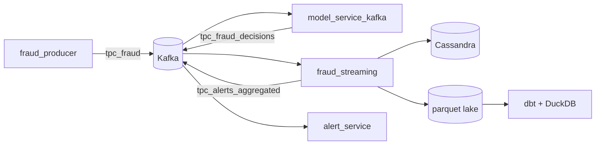

# Fraud Pipeline

Monorepo for a real-time fraud detection platform and local analytics on the streaming parquet lake.

## Layout

```
fraud_pipeline/
├── docker-compose.yml       # Full stack (infra + streaming apps)
├── fraud_streaming/         # Kafka, Spark, model, alerts, parquet lake
│   ├── src/
│   ├── models/
│   └── docker-compose.yml   # App services only (modular)
└── dbt/                     # DuckDB + dbt on local parquet
    └── docker-compose.yml
```

## Architecture



| Component | Location |
|-----------|----------|
| Event producer | `fraud_streaming/src/app/fraud_producer.py` |
| Model service | `fraud_streaming/src/app/model_service_kafka.py` |
| Spark streaming | `fraud_streaming/src/app/fraud_streaming.py` |
| Alerts | `fraud_streaming/src/app/alert_service.py` |
| Analytics | `dbt/` |

## Quick start

### 1. Train the fraud model

```bash
cd fraud_streaming
python -m venv .venv && source .venv/bin/activate
pip install -r requirements.txt
python src/app/train_model.py
cd ..
```

### 2. Start the full stack

From the repository root:

```bash
docker compose up -d
docker compose --profile demo up -d   # optional demo producer
```

Python app services (`model-service`, `alert-service`, `fraud-producer`) now use
the image built from `fraud_streaming/src/app/Dockerfile` for faster startup
(dependencies preinstalled). Rebuild when Python code changes:

```bash
docker compose build model-service
```

Alternative: run only the producer without Compose (Kafka and model-service must already be running):

```bash
docker run --rm -it \
  --name kafka-fraud-producer \
  --network data-platform-net \
  -v /home/cyril/projects/fraud_pipeline/fraud_streaming/src:/app \
  -w /app \
  -e PYTHONPATH=/app \
  -e KAFKA_BOOTSTRAP_SERVERS=kafka:9092 \
  python:3.11 \
  bash -c "pip install kafka-python && python app/fraud_producer.py"
```

- Spark UI: http://localhost:8080 (master), http://localhost:8081 (worker)
- Kafka: `localhost:9092`
- Cassandra: `localhost:9042`

### 3. Explore parquet with dbt

After the stream has written data to `fraud_streaming/data/parquet/`:

```bash
cd dbt
docker compose run --rm dbt deps
docker compose run --rm dbt run
```

See [dbt/README.md](dbt/README.md) for details.

### 4. Slack alerts

Create a Slack app first (for example `fraud_detection`) at
[https://api.slack.com/apps](https://api.slack.com/apps), then create an Incoming
Webhook URL for your channel.
Slack web client is available at [https://app.slack.com/client](https://app.slack.com/client).

Set `SLACK_WEBHOOK` in `fraud_streaming/src/app/alert_service.py`. Do not commit webhook URLs.

## Kafka topics

| Topic | Producer | Consumer |
|-------|----------|----------|
| `tpc_fraud` | `fraud_producer` | `model_service_kafka` |
| `tpc_fraud_decisions` | `model_service_kafka` | `fraud_streaming`, `alert_service` |
| `tpc_alerts_aggregated` | `fraud_streaming` | `alert_service` |

Quick test: consume messages from Kafka inside the broker container:

```bash
docker exec -it kafka bash
kafka-console-consumer --bootstrap-server localhost:9092 --topic tpc_fraud --from-beginning
```

## Cassandra quick checks

Use `cqlsh` in the Cassandra container to verify schema is created:

```bash
docker exec -it cassandra cqlsh

desc keyspaces;
USE mykeyspace;

desc tables;
desc table fraud;
```

## Modular compose

**Streaming apps only** (`fraud_streaming/`):

```bash
docker network create data-platform-net
cd fraud_streaming
docker compose -f docker-compose-kafka-cassandra.yml up -d
docker compose -f docker-compose-spark.yml up -d
docker compose up -d
```

**dbt only** (`dbt/`): requires parquet data and the `data-platform-net` network (created by root `docker compose up`).

## Local development

```bash
cd fraud_streaming
export PYTHONPATH=src
python src/app/validate_spark.py
```

## Troubleshooting

### Spark: `UnknownTopicOrPartitionException` on `tpc_fraud_decisions`

Spark starts before the Kafka topic exists. The stack now runs `kafka-init` to create `tpc_fraud`, `tpc_fraud_decisions`, and `tpc_alerts_aggregated` before `spark-driver`.

If you reset Kafka or still see this error, clear the streaming checkpoint and recreate the driver:

```bash
docker compose stop spark-driver
rm -rf fraud_streaming/.checkpoint
docker compose up -d kafka-init
docker compose up -d spark-driver
```

Ensure the demo producer (or model service) is sending events so `tpc_fraud_decisions` receives data.

### Spark: `Mkdirs failed` when writing parquet

Parquet files are written by Spark **executors** on `spark-worker`, not only on `spark-driver`. The worker must mount `fraud_streaming` at `/streaming` (configured in `docker-compose.yml`). After changing mounts, recreate the worker and driver:

```bash
docker compose up -d --force-recreate spark-worker spark-driver
```

## Stopping services

```bash
docker compose --profile demo down
docker compose down
```
