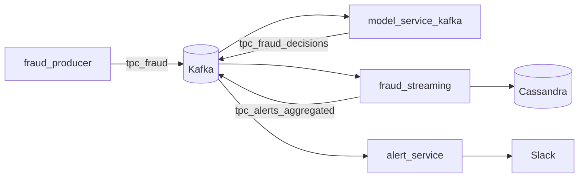

# Fraud Pipeline

A real-time fraud detection pipeline that ingests transaction events from Kafka, scores them with a scikit-learn model, aggregates blocked transactions in Apache Spark Structured Streaming, persists results to Cassandra, and sends alerts to Slack.

## Architecture



| Component | Role |
|-----------|------|
| `fraud_producer.py` | Simulates transaction events and publishes to `tpc_fraud` |
| `model_service_kafka.py` | Consumes events, runs Random Forest inference, emits ALLOW/BLOCK decisions |
| `fraud_streaming.py` | Spark job: writes BLOCK events to Cassandra; emits spike alerts when BLOCK count ≥ 3 per batch |
| `alert_service.py` | Consumes decision and aggregated alert topics; posts to Slack (rate-limited) |
| `train_model.py` | Trains a small demo model and saves `models/fraud_model.pkl` |

## Prerequisites

- Docker and Docker Compose
- Python 3.11+ (for local development and training)
- Enough memory for Spark, Kafka, and Cassandra containers

## Quick start

### 1. Train the fraud model

From the repository root:

```bash
python -m venv .venv
source .venv/bin/activate
pip install -r requirements.txt
mkdir -p src/app/models
cd src/app && python train_model.py && cd ../..
```

This writes `src/app/models/fraud_model.pkl`, which `model_service_kafka.py` loads at startup.

### 2. Start the full stack (recommended)

From the repository root:

```bash
docker compose up -d
```

This starts Kafka, Cassandra (with schema init), Spark, the model service, Spark streaming, and the alert service. To also run the demo event producer:

```bash
docker compose --profile demo up -d
```

- Spark UI: http://localhost:8080 (master), http://localhost:8081 (worker)
- Kafka: `localhost:9092` (host); containers use `kafka:9092`
- Cassandra CQL: `localhost:9042`

The `cassandra-init` service applies `src/app/cassandra/schema.cql` once Cassandra is ready.

### 3. Configure Slack alerts

Set `SLACK_WEBHOOK` in `alert_service.py` to your [Incoming Webhook](https://api.slack.com/messaging/webhooks) URL. Do not commit webhook URLs to version control.

`ALERT_COOLDOWN` (default 10 seconds) limits instant per-event alerts; aggregated spike alerts are always sent.

## Kafka topics

| Topic | Producer | Consumer |
|-------|----------|----------|
| `tpc_fraud` | `fraud_producer` | `model_service_kafka` |
| `tpc_fraud_decisions` | `model_service_kafka` | `fraud_streaming`, `alert_service` |
| `tpc_alerts_aggregated` | `fraud_streaming` | `alert_service` |

## Cassandra

Blocked transactions are appended to keyspace `mykeyspace`, table `fraud` (see `fraud_streaming.py`). The root `docker compose up` runs `cassandra-init`, which applies the DDL below. You can also apply it manually:

```bash
docker exec -i cassandra cqlsh < src/app/cassandra/schema.cql
```

DDL (`src/app/cassandra/schema.cql`):

```cql
CREATE KEYSPACE IF NOT EXISTS mykeyspace
  WITH replication = {'class': 'SimpleStrategy', 'replication_factor': 1};

CREATE TABLE IF NOT EXISTS mykeyspace.fraud (
  transaction_id text PRIMARY KEY,
  fraud_probability text,
  decision text,
  timestamp timestamp
);
```

Column types match the Spark stream schema (`fraud_probability` is stored as text). Change `key_space` / `cass_table_name` in `fraud_streaming.py` if you use different names.

## Project layout

```
fraud_pipeline/
├── docker-compose.yml        # Full stack (preferred)
├── requirements.txt          # Dev / Spark / training deps
├── README.md
└── src/
    ├── lib/
    │   └── kafka_utils.py    # Kafka producer helper
    └── app/
        ├── fraud_producer.py
        ├── model_service_kafka.py
        ├── fraud_streaming.py
        ├── alert_service.py
        ├── train_model.py
        ├── validate_spark.py   # Local Spark smoke test
        ├── cassandra/
        │   └── schema.cql
        ├── Dockerfile
        ├── model-service-requirements.txt
        └── docker-compose*.yml   # Modular stacks (optional)
```

### Modular compose (optional)

Split stacks under `src/app/` still work if you prefer step-by-step startup. They expect an external Docker network:

```bash
docker network create data-platform-net
cd src/app
docker compose -f docker-compose-kafka-cassandra.yml up -d
docker compose -f docker-compose.yml up -d
docker compose -f docker-compose-fraudstreaming.yml up -d
```

## Local development

- **Spark smoke test:** `python src/app/validate_spark.py` (local `local[*]` master).
- **Producer / model service:** Expect Kafka at `kafka:9092` when run inside Docker; use `localhost:9092` when running on the host against the published port.
- **Python path:** Application code imports `lib.kafka_utils`; run with `PYTHONPATH=src` from the repo root.

## Model details

`train_model.py` fits a `RandomForestClassifier` on synthetic features `(amount, country_risk)`. `model_service_kafka.py` blocks when fraud probability exceeds `fraud_threshold_model` (0.8). Replace training data and thresholds for production use.

## Stopping services

Full stack (from repo root):

```bash
docker compose --profile demo down
docker compose down
```

Modular stacks: run `docker compose -f … down` for each file under `src/app/`, then `docker network rm data-platform-net` if you created it.
